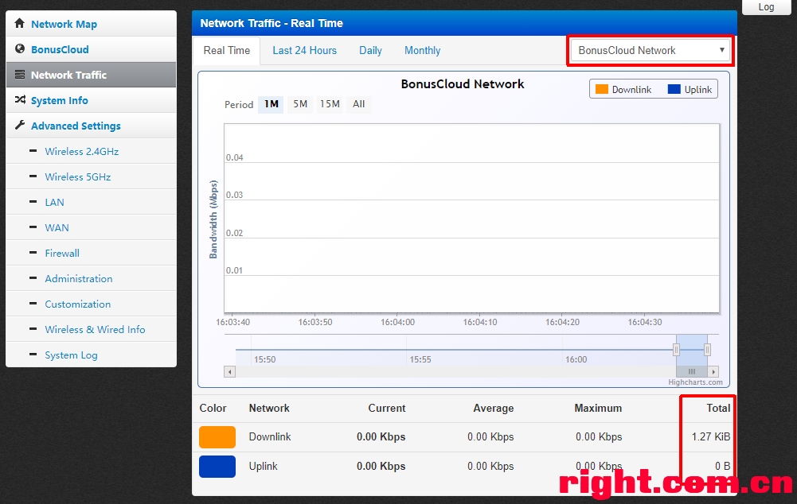

# BonusCloud-Node-K2

## Install Procedure:
1. Install Breed bootloader. http://www.right.com.cn/forum/thread-161906-1-1.html
2. Restore default settings in Breed.
3. Flash firmware. PSG1218_3.4.3.9-099-bxc_0.2.2-6p.trx
4. reboot.

Web: http://192.168.2.1/

Username: admin  
Password: admin

Snapshots:
---

